# Robot Tests (read extension and dereplication)

Rulegraph

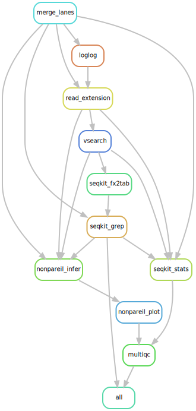

Filegraph

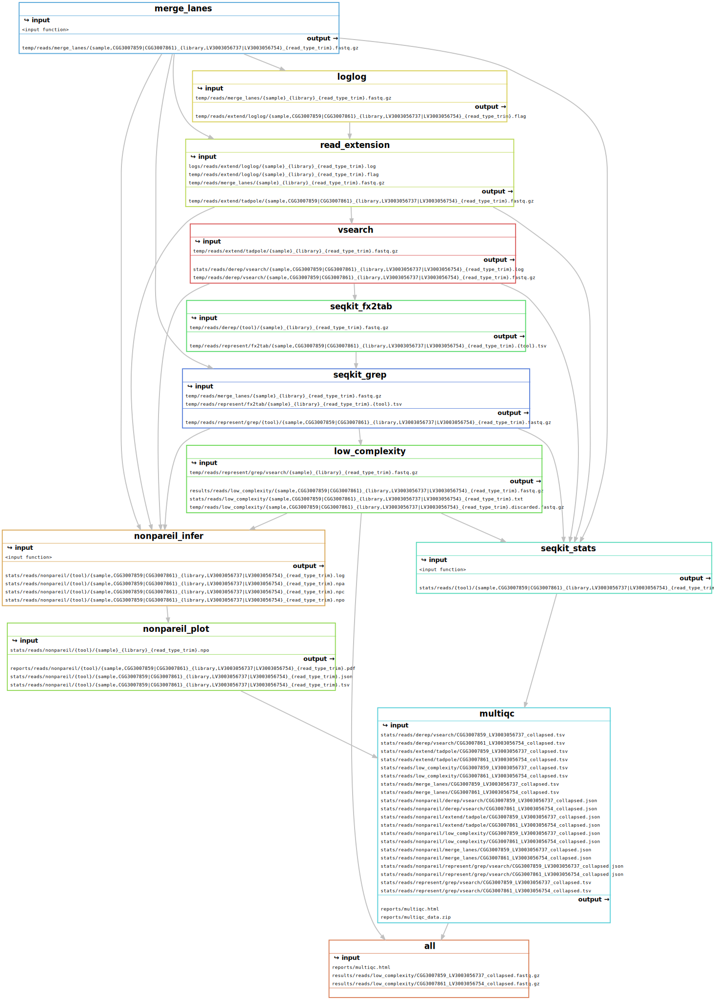

DAG

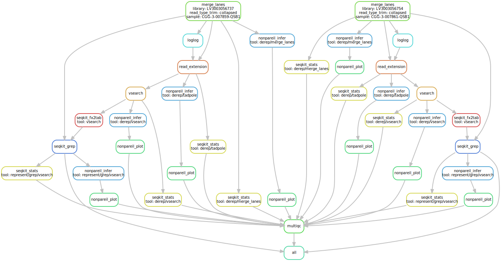

# Robot Tests (read extension but no dereplication)

Rulegraph

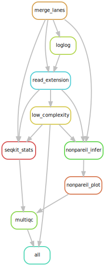

Filegraph

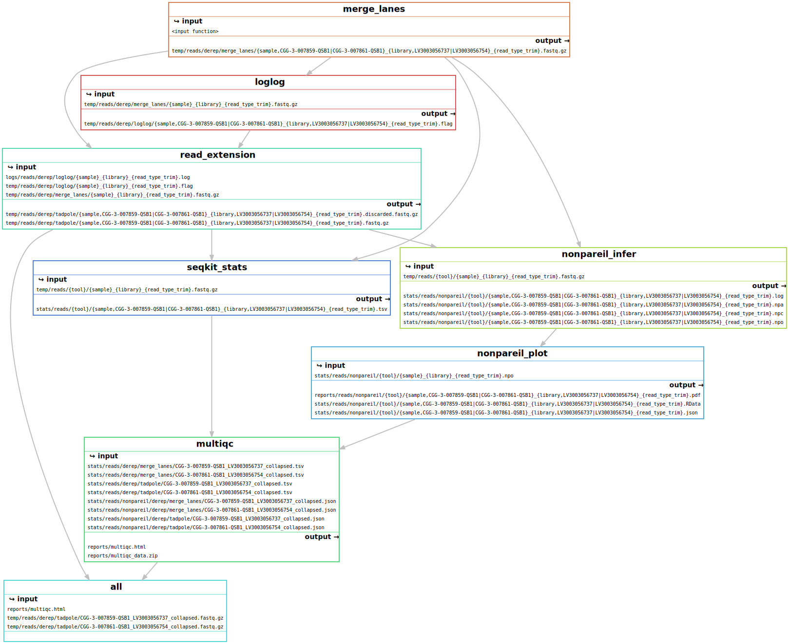

DAG

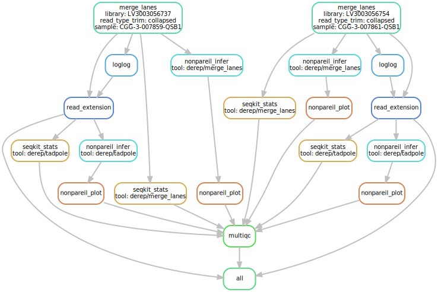

# Robot Tests (read dereplication but no extension)

Rulegraph

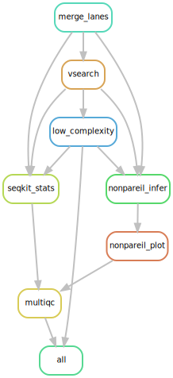

Filegraph

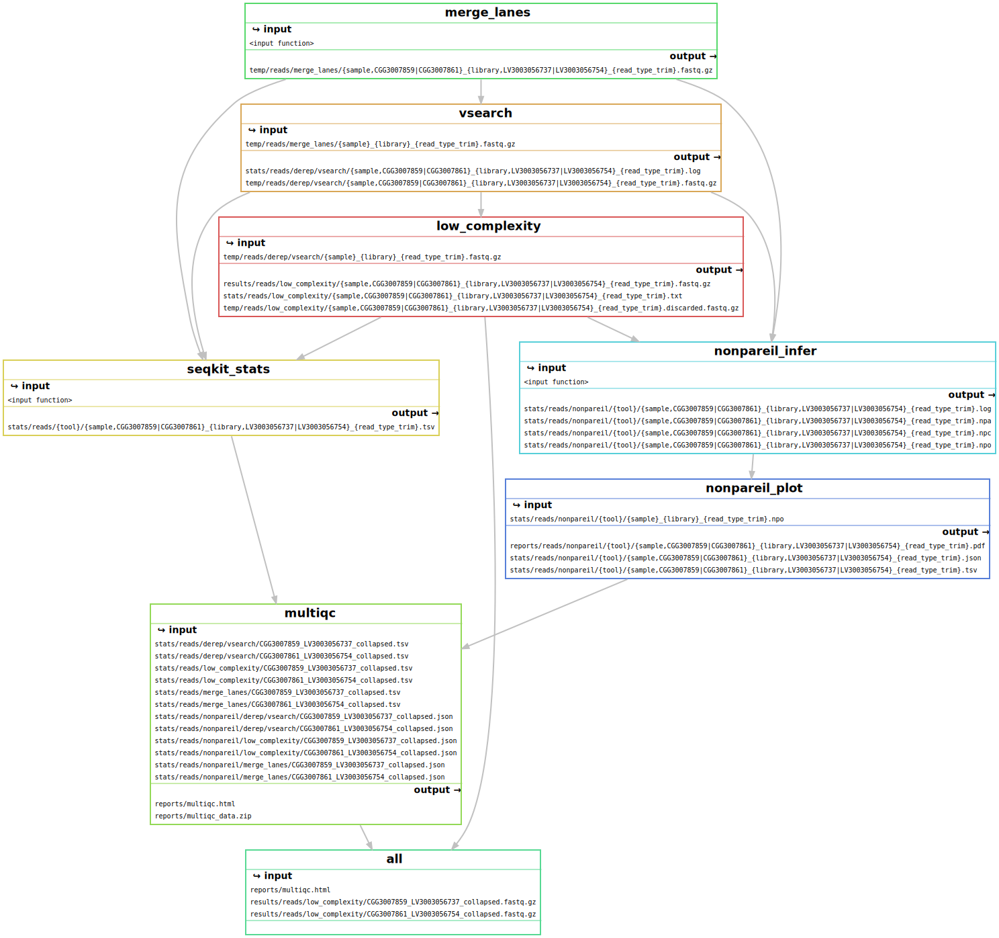

DAG

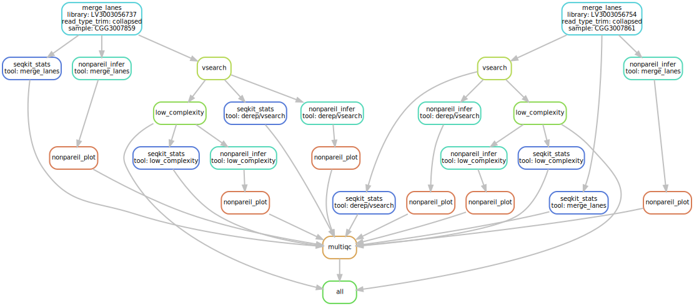

# Robot Tests (no read extension or dereplication)

Rulegraph

Filegraph

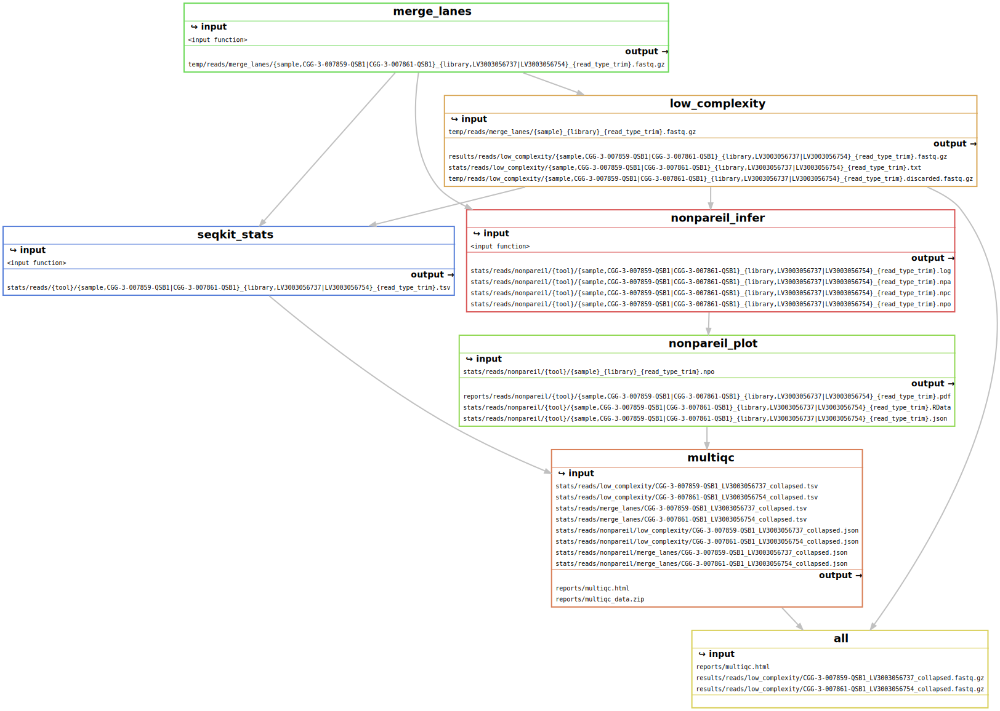

DAG

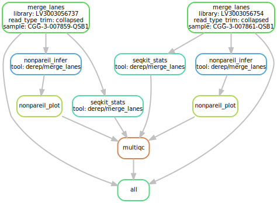

