# HD827sonic (read extension and dereplication)

Rulegraph

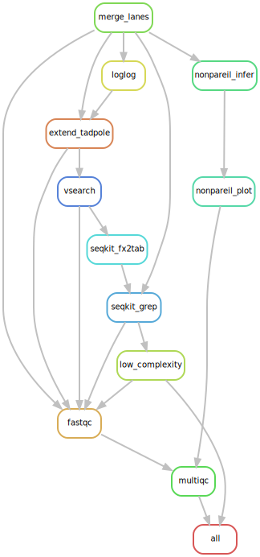

DAG

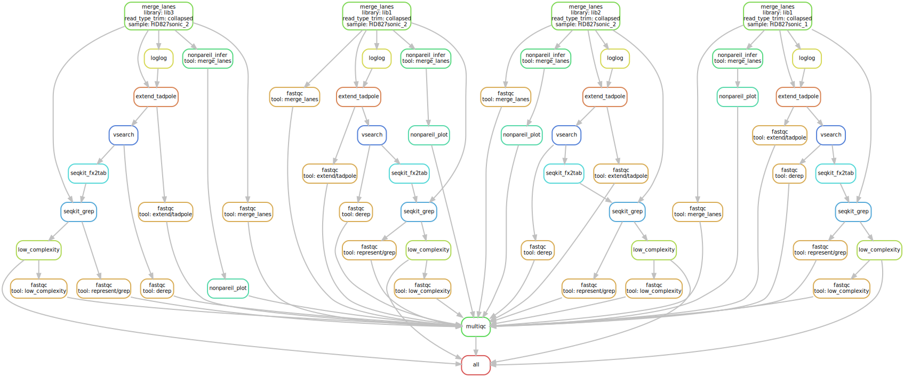

Filegraph

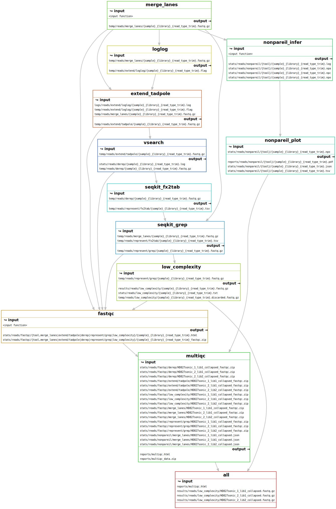

# HD827sonic (read extension but no dereplication)

Rulegraph

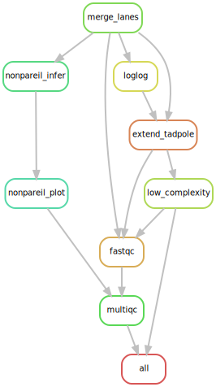

DAG

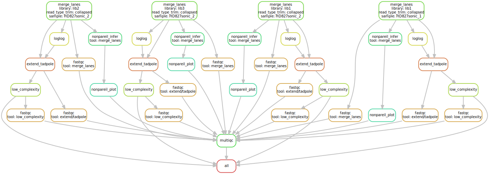

Filegraph

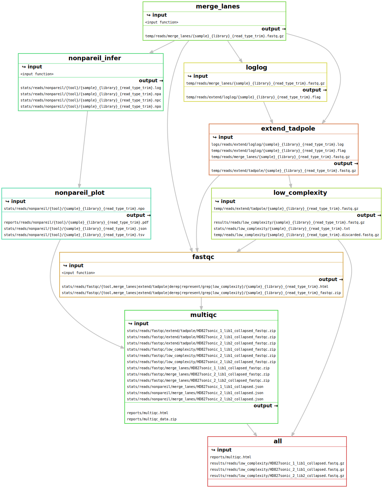

# HD827sonic (read dereplication but no extension)

Rulegraph

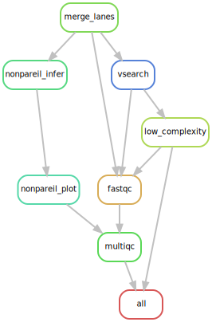

DAG

Filegraph

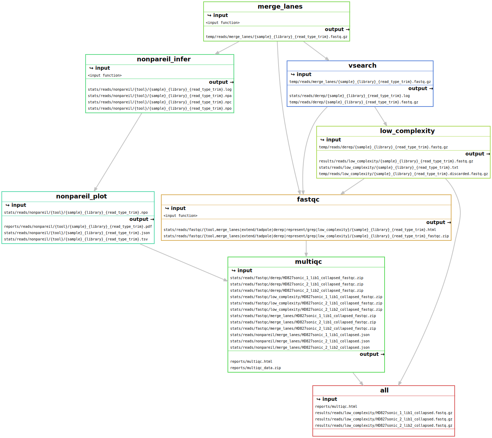

# HD827sonic (no read extension or dereplication)

Rulegraph

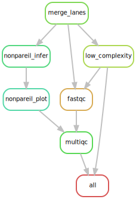

DAG

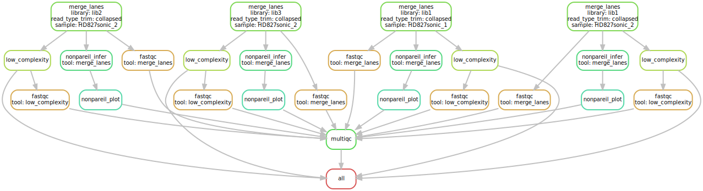

Filegraph

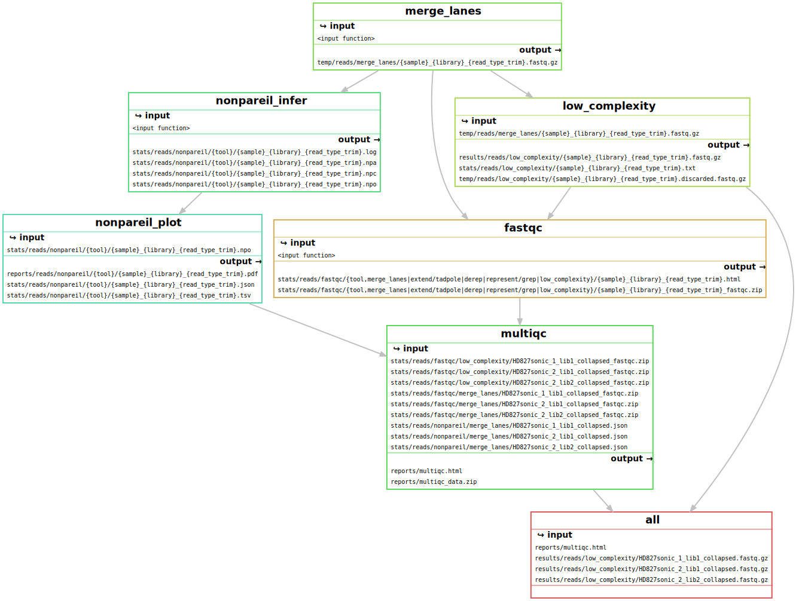

