# HD827sonic (read dereplication with VSEARCH and extension)

Rulegraph

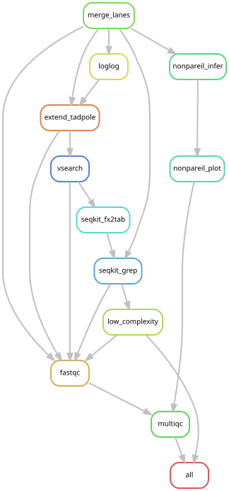

DAG

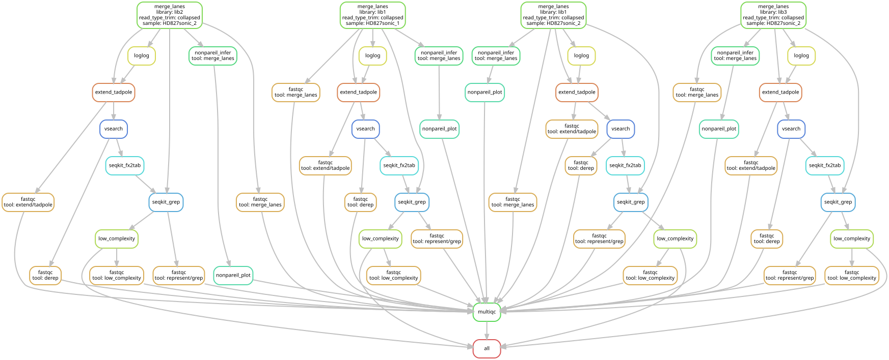

Filegraph

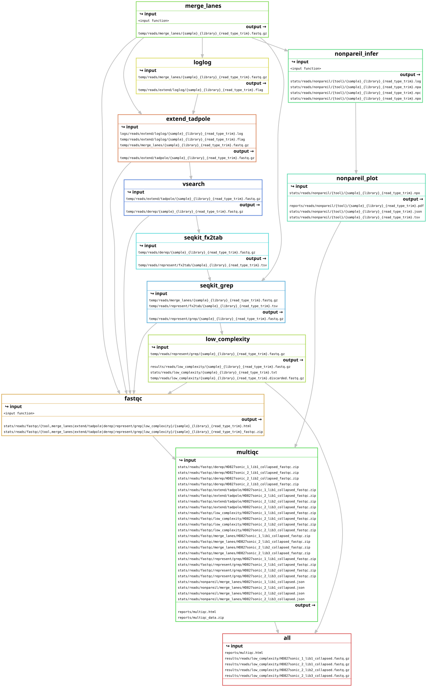

# HD827sonic (no read dereplication but extension)

Rulegraph

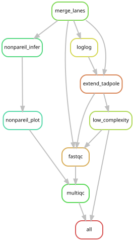

DAG

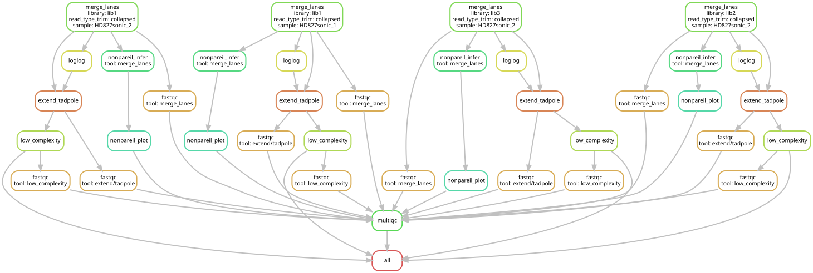

Filegraph

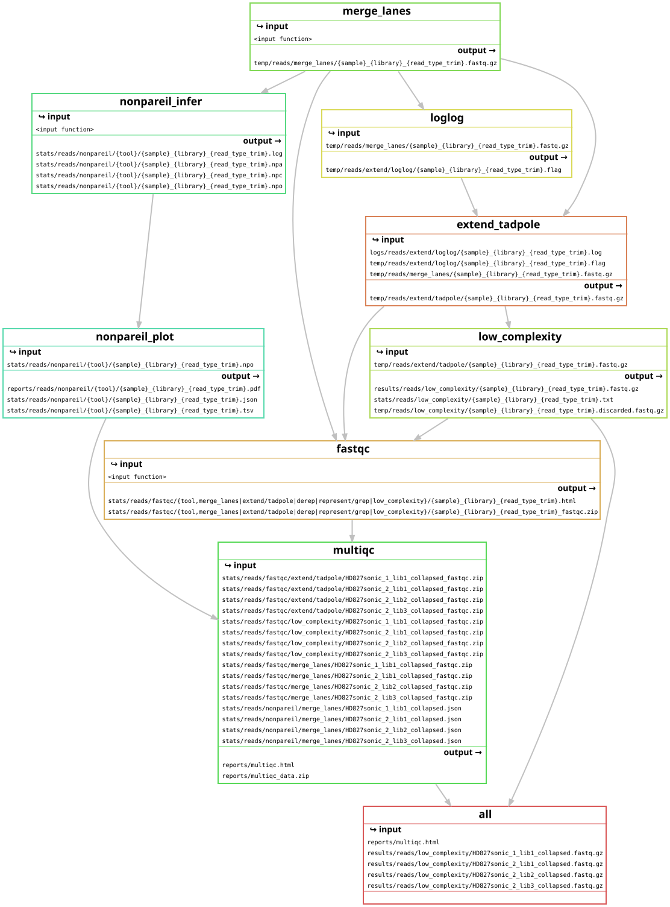

# HD827sonic (read dereplication with SeqKit but no extension)

Rulegraph

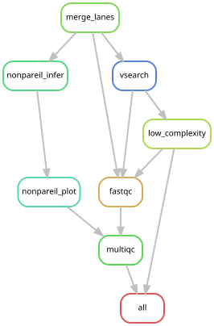

DAG

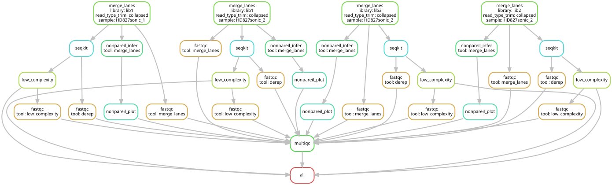

Filegraph

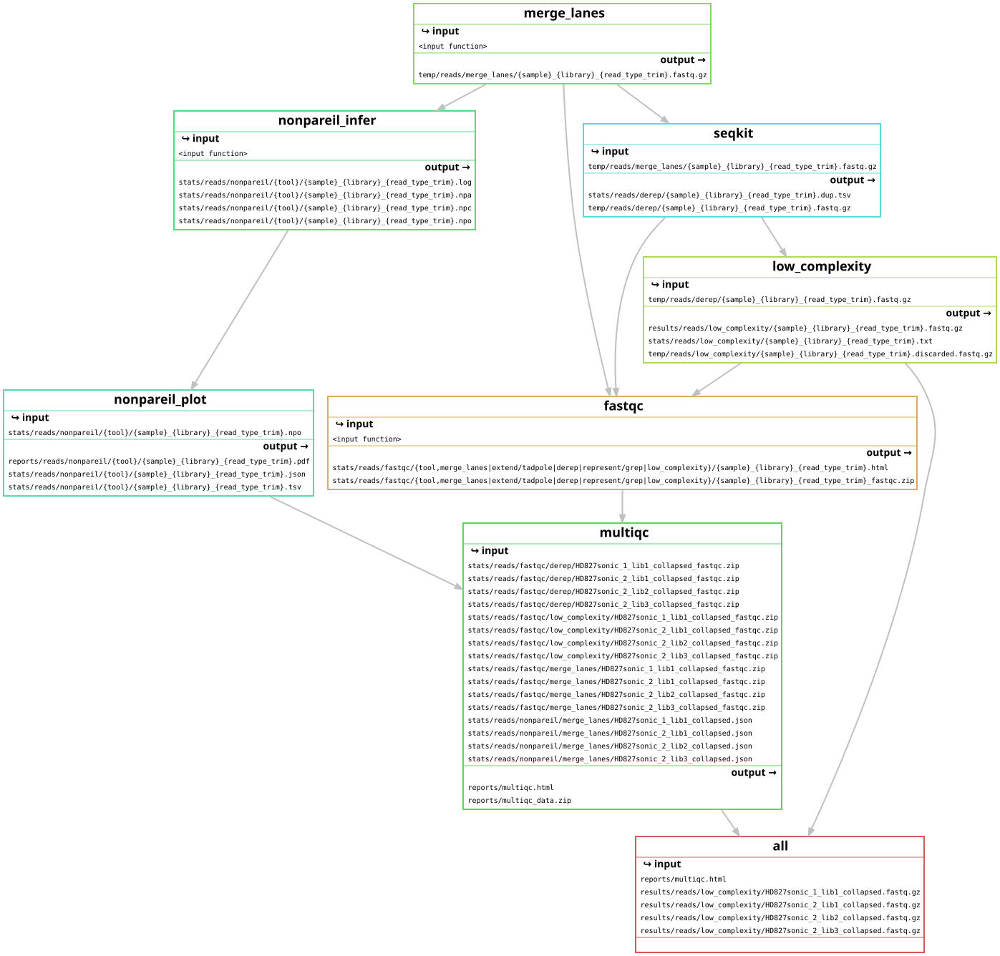

# HD827sonic (read dereplication with Swarm but no extension)

Rulegraph

DAG

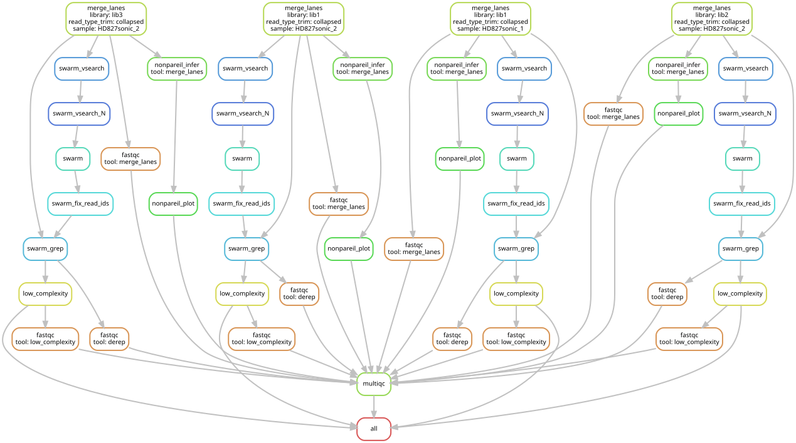

Filegraph

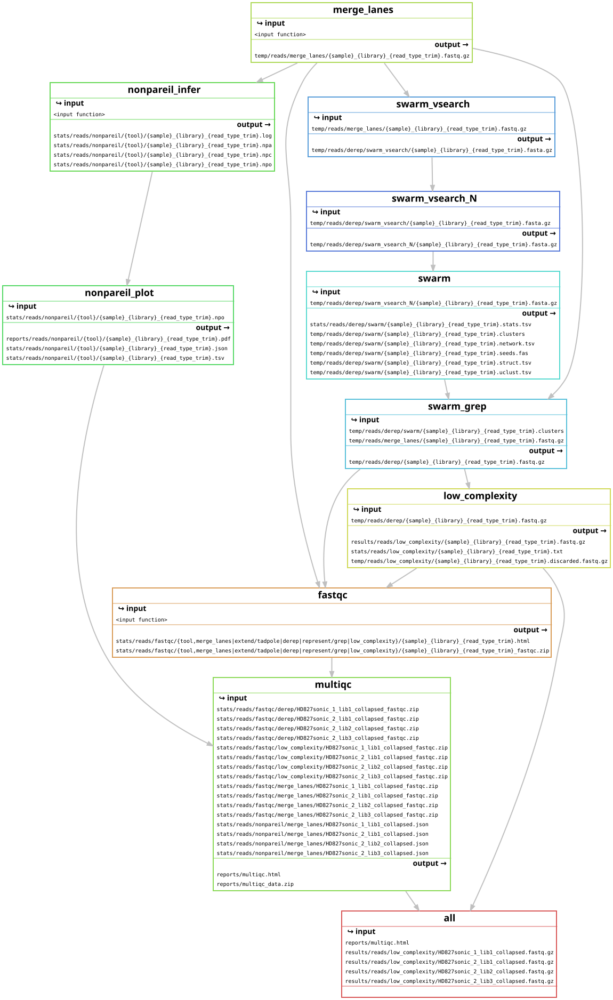

# HD827sonic (no read dereplication or extension)

Rulegraph

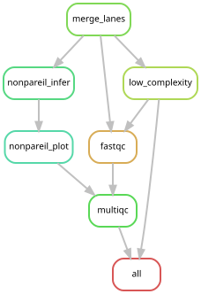

DAG

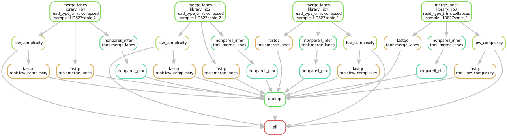

Filegraph

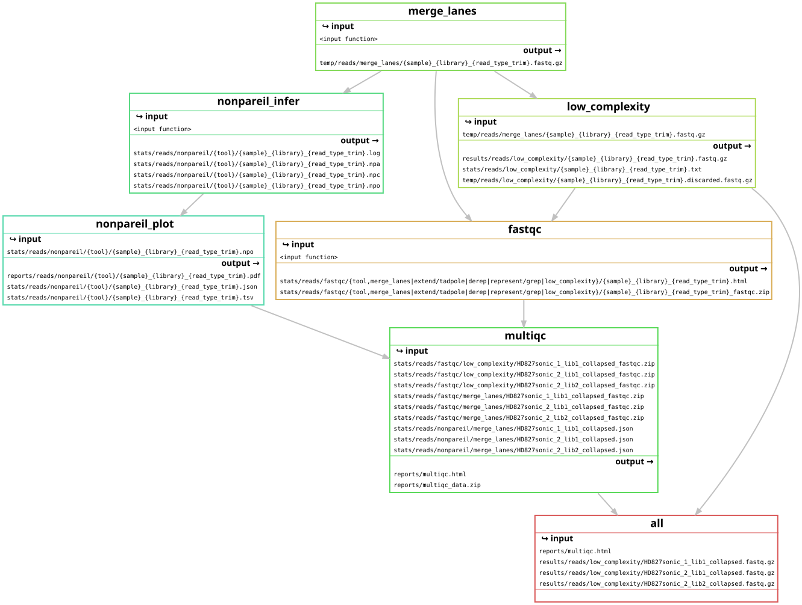

